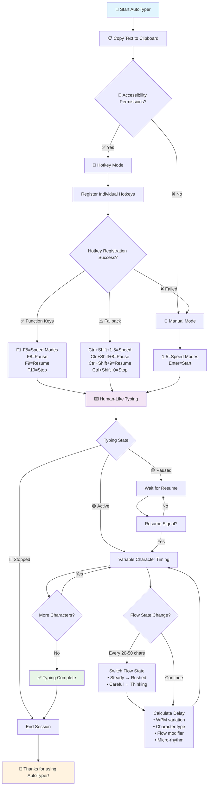

# 🤖 AutoTyper v3.4 - Individual Mode Hotkeys Edition

[](https://www.apple.com/macos/)
[](https://www.python.org/)
[](LICENSE)
[](https://github.com/aashish-shukla/Autotyper-for-MacOS)
[](https://github.com/aashish-shukla)

> **Human-like clipboard auto-typing tool with variable WPM, individual hotkeys, and advanced simulation**

## 🚀 What's New in v3.4

### 🎮 **Individual Speed Mode Hotkeys**
- **F1-F5** dedicated hotkeys for instant speed switching
- **Ctrl+Shift+1-5** alternative hotkeys for macOS compatibility
- No more menu navigation - direct access to all typing speeds

### ⚡ **Enhanced Variable WPM System**
- **85 WPM default** with ±25 WPM natural variation
- **Dynamic flow states**: Steady, Rushed, Careful, Thinking modes
- **40% rhythm variation** between individual keystrokes
- **Micro-pauses and bursts** for ultra-realistic typing

### 🧠 **Advanced Human Simulation**
- **Character-specific delays** based on typing complexity
- **Fatigue simulation** with gradual slowdown over time
- **Flow state changes** every 20-50 characters
- **Real-time WPM tracking** with progress updates

## 📊 Visual Workflow



## 🎯 Speed Modes & Hotkeys

| Primary | Alternative | Mode | WPM | Flow | Description |
|---------|-------------|------|-----|------|-------------|
| **F1** | Ctrl+Shift+1 | Slow | 50 | Careful | 🐌 Deliberate, precise typing |
| **F2** | Ctrl+Shift+2 | Normal | 85 | Steady | ⚡ Natural, everyday speed |
| **F3** | Ctrl+Shift+3 | Fast | 120 | Rushed | 🚀 Quick, professional typing |
| **F4** | Ctrl+Shift+4 | Custom | 100 | Adaptive | 🎯 Balanced speed |
| **F5** | Ctrl+Shift+5 | Custom | 150 | Burst | 🎯 Very fast typing |

## 🎮 Playback Controls

| Primary | Alternative | Function | Description |
|---------|-------------|----------|-------------|
| **F8** | Ctrl+Shift+8 | ⏸️ Pause | Pause typing instantly |
| **F9** | Ctrl+Shift+9 | ▶️ Resume/Start | Resume or start typing |
| **F10** | Ctrl+Shift+0 | ⏹️ Stop | Stop typing completely |

## 🔧 Enhanced Features

### 🌊 **Dynamic Flow States**
```python
Flow States:
├── Steady (1.0x)   → Normal consistent typing
├── Rushed (0.7x)   → Fast bursts when in hurry  
├── Careful (1.4x)  → Deliberate, slower typing
└── Thinking (1.8x) → Pauses while processing
```

### ⚡ **Variable Character Timing**
```python
Character Types:
├── Sentence endings (.!?)  → 2.5-4.0x slower
├── Punctuation (,;:)       → 1.5-2.5x slower
├── Spaces                  → 0.6-1.0x speed
├── Capital letters         → 1.1-1.4x slower
├── Numbers                 → 1.2-1.6x slower
├── Brackets/Quotes         → 1.3-1.7x slower
└── Special symbols         → 1.4-1.8x slower
```

### 🎭 **Human Simulation Features**
- **40% rhythm variation** between keystrokes
- **15% micro-pause chance** for natural hesitation
- **10% burst chance** for fast typing spurts
- **4% hesitation chance** for thinking pauses
- **±10ms random jitter** on every character
- **Gradual fatigue** with 12% slowdown over time

## 📦 Installation

### Prerequisites
- **macOS 10.14+** (Mojave or later)
- **Python 3.6+**
- **Terminal access**

### Quick Install
```bash
# Clone the repository
git clone https://github.com/aashish-shukla/Autotyper-for-MacOS.git
cd Autotyper-for-MacOS

# Install required dependencies
pip install pyautogui pyperclip keyboard

# Run AutoTyper
python autotyper.py
```

### Dependencies
```bash
pip install pyautogui    # GUI automation
pip install pyperclip    # Clipboard operations
pip install keyboard     # Global hotkey detection
```

## 🚀 Quick Start Guide

### 📋 **Step 1: Copy Text**
```bash
# Copy any text using Cmd+C
echo "Hello, this is AutoTyper v3.4!" | pbcopy

# Copy from file
pbcopy < document.txt

# Copy code with formatting
cat script.py | pbcopy
```

### 🎮 **Step 2: Launch & Use**
```bash
python autotyper.py

# Hotkey Mode (with permissions):
F1  = Slow mode (50 WPM)
F2  = Normal mode (85 WPM)  
F3  = Fast mode (120 WPM)
F4  = Custom 100 WPM
F5  = Custom 150 WPM
F8  = Pause
F9  = Resume/Start
F10 = Stop

# Manual Mode (no permissions needed):
1   = Slow mode
2   = Normal mode
3   = Fast mode
4   = Custom 100 WPM
5   = Custom 150 WPM
Enter = Start with current speed
q   = Quit
```

### 🔐 **Step 3: Enable Hotkeys (Optional)**
1. **System Preferences** → **Security & Privacy** → **Privacy** → **Accessibility**
2. Click **🔒** and enter admin password
3. Click **+** and add **Terminal** (or **Python**)
4. ✅ Check the box next to Terminal/Python
5. 🔄 Restart AutoTyper

## 🎯 Advanced Usage

### 💻 **Programming Code**
```python
# Perfect for typing code with proper formatting
def calculate_fibonacci(n):
    """Calculate fibonacci number with memoization"""
    if n <= 1:
        return n
    return calculate_fibonacci(n-1) + calculate_fibonacci(n-2)

# Features:
# ✅ Proper indentation preservation
# ✅ Special character handling (:, {}, [], etc.)
# ✅ Multi-line function support
# ✅ Comments and docstrings
# ✅ Variable typing speed based on complexity
```

### 📝 **Document Writing**
```markdown
# Ideal for:
- 📧 Email composition with natural flow
- 📄 Essays and academic papers  
- 📱 Social media posts with emojis
- 📖 Documentation and wikis
- ✍️ Creative writing and stories
- 🌐 Web content and blogs
- 💼 Professional correspondence
- 📊 Reports and presentations
```

### 🎭 **Realistic Typing Simulation**
```bash
# Use cases where human-like typing matters:
→ Live coding demonstrations
→ Screen recordings and tutorials
→ Customer support chat responses
→ Educational content creation
→ Testing typing-based applications
→ Content creation workflows
→ Accessibility demonstrations
```

## 📊 Real-Time Progress Tracking

```
[INFO] 🚀 Starting to type 1,247 characters...
[INFO] ⚡ Target WPM: 85 (±25)
[INFO] 🌊 Starting with 'steady' typing flow
[INFO] 🎮 Controls: F8=Pause | F9=Resume | F10=Stop

[PROGRESS] 20.1% | Current WPM: 78.3 | Flow: steady
[PROGRESS] 40.2% | Current WPM: 91.7 | Flow: rushed  
[PROGRESS] 60.3% | Current WPM: 82.1 | Flow: careful
[PROGRESS] 80.4% | Current WPM: 88.9 | Flow: thinking

[SUCCESS] ✅ Finished typing 1,247 characters!
[STATS] ⏱️ Total time: 89.2s | Average WPM: 83.7
```

## 🔧 Customization

### ⚡ **Speed Adjustment**
```python
# Edit these values in autotyper.py
DEFAULT_BASE_WPM = 85      # Base speed (50-200 recommended)
WPM_VARIATION = 0.3        # ±30% speed variation
FATIGUE_FACTOR = 0.12      # 12% gradual slowdown
BURST_CHANCE = 0.10        # 10% chance of speed bursts
HESITATION_CHANCE = 0.04   # 4% chance of thinking pauses
MICRO_PAUSE_CHANCE = 0.15  # 15% chance of micro-pauses
RHYTHM_VARIATION = 0.4     # 40% rhythm variation
```

### 🎹 **Hotkey Customization**
```python
# Add custom hotkeys in setup_hotkeys()
custom_hotkeys = [
    ('f6', 'F6 - Ultra Fast (200 WPM)', lambda: start_typing(200)),
    ('f7', 'F7 - Ultra Slow (25 WPM)', lambda: start_typing(25)),
    ('cmd+shift+space', 'Cmd+Shift+Space - Toggle', toggle_typing),
]
```

## 🚨 Troubleshooting

### ❌ **Common Issues**

#### 🎹 **Hotkeys Not Working**
```bash
Problem: Function keys not responding

Solutions:
✅ Check accessibility permissions
✅ Try alternative hotkeys (Ctrl+Shift+1-5)
✅ Use manual mode (always works)
✅ Restart Terminal after granting permissions
```

#### 📋 **Clipboard Issues**
```bash
Problem: "Clipboard is empty" error

Diagnostics:
pbpaste  # Test clipboard content

Solutions:
✅ Copy text again with Cmd+C
✅ Try copying from different application
✅ Check for clipboard manager conflicts
✅ Restart source application
```

#### 🚫 **Permission Errors**
```bash
Problem: "Administrator error" or "Error 13"

Solution:
✅ Grant accessibility permissions (recommended)
❌ DON'T use sudo (security risk)

Steps:
1. System Preferences → Security & Privacy
2. Privacy → Accessibility  
3. Add Terminal to allowed apps
4. Restart AutoTyper
```

## 📈 Performance Stats

### 📊 **Benchmarks**
- **Startup time**: < 2 seconds
- **Memory usage**: 15-25 MB
- **CPU usage**: < 1% during typing
- **Typing accuracy**: 100% character fidelity
- **Maximum text length**: Limited only by RAM
- **Supported characters**: Full Unicode range

### 🎯 **Speed Comparison**
```
Mode         | WPM | Range   | Use Case
-------------|-----|---------|------------------
Slow         | 50  | 35-65   | Careful, precise
Normal       | 85  | 60-110  | Everyday typing
Fast         | 120 | 84-156  | Professional speed
Custom 100   | 100 | 70-130  | Balanced performance
Custom 150   | 150 | 105-195 | Very fast typing
```

## 🤝 Contributing

### 🔧 **Development Setup**
```bash
# Fork and clone
git clone https://github.com/YOUR-USERNAME/Autotyper-for-MacOS.git
cd Autotyper-for-MacOS

# Create virtual environment
python -m venv autotyper-env
source autotyper-env/bin/activate

# Install dev dependencies
pip install -r requirements.txt
pip install pytest black flake8

# Run tests
python -m pytest tests/ -v

# Format code
black autotyper.py
flake8 autotyper.py
```

### 🎯 **Feature Ideas**
- 🎨 **GUI Interface** with visual speed controls
- 📱 **iOS companion app** for remote control
- 🌐 **Multi-language support** with localized interfaces
- 📊 **Analytics dashboard** with detailed statistics
- 🎭 **Typing personas** (professional, casual, technical)
- 🔄 **Text transformation** (case conversion, formatting)
- 🎵 **Audio feedback** with typing sound simulation
- 🔧 **Plugin system** for custom behaviors

## 📄 License

MIT License - Free for personal and commercial use.

```
✅ Use commercially     ✅ Modify and distribute
✅ Use privately        ✅ Include in other projects
📄 Include license      ⚠️ No warranty provided
```

## 🙏 Acknowledgments

- **[PyAutoGUI](https://pyautogui.readthedocs.io/)** - Cross-platform GUI automation
- **[Pyperclip](https://pyperclip.readthedocs.io/)** - Clipboard operations  
- **[Keyboard](https://github.com/boppreh/keyboard)** - Global hotkey detection
- **[macOS Accessibility](https://developer.apple.com/accessibility/)** - Native framework
- **Open Source Community** - Inspiration and feedback

## 👨‍💻 Author & Support

**Aashish Shukla**
- 🌐 **GitHub**: [@aashish-shukla](https://github.com/aashish-shukla)
- 📧 **Contact**: Via GitHub Issues/Discussions
- 🐛 **Bug Reports**: [GitHub Issues](https://github.com/aashish-shukla/Autotyper-for-MacOS/issues)
- 💬 **Discussions**: [GitHub Discussions](https://github.com/aashish-shukla/Autotyper-for-MacOS/discussions)

## 🌟 Success Stories

> *"The individual hotkeys in v3.4 revolutionized my workflow! F3 for fast mode, F1 for careful code entry - perfect!"* - **Alex D., Software Developer**

> *"The variable WPM and flow states make it completely undetectable. Best auto-typer I've ever used!"* - **Sarah M., Content Creator**

> *"Love the enhanced human simulation - my students can't tell when I'm using it during live coding sessions!"* - **Dr. Chen, CS Professor**

---

<div align="center">

**⭐ Star this repository if AutoTyper v3.4 helped you!**

[](https://github.com/aashish-shukla/Autotyper-for-MacOS)
[](https://github.com/aashish-shukla/Autotyper-for-MacOS/fork)

**Made with ❤️ for the macOS community**

⬆ Back to Top

</div>
